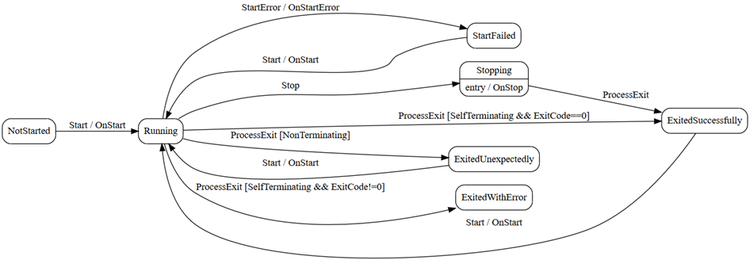

# Little Forker [](https://travis-ci.org/damianh/LittleForker) [](https://www.nuget.org/packages/LittleForker)

A utility to aid in the launching and supervision of processes. The primary use
case is installing a single service who then spawns other processes as part of a
multi-process application.

## Features

  1. **ProcessExitedHelper**: a helper around `Process.Exited` with some additional
     logging and event raising if the process has already existed or not found.

  2. **ProcessSupervisor**: allows a parent process to launch a child process
     and track it's lifecycle which is represented as a state machine.
     Supervisors can participate in co-operative shutdown.

  3. **CooperativeShutdown**: allows a process to listen for a shutdown signal
     over a NamedPipe or for a process to instruct a process to shutdown.

## Installation

```bash
dotnet add package LittleForker 
```

CI packages are on personal feed: https://www.myget.org/F/dh/api/v3/index.json 

## Using

### 1. ProcessExitedHelper

This helper is typically used by "child" processes to monitor a "parent" process
so that it exits itself when the parent exists. It's also safe guard in
co-operative shut down if the parent failed to signal correctly (i.e. it
crashed).

It wraps `Process.Exited` with some additional behavior:

 - Raises the event if the process is not found.
 - Raises the event if the process has already exited which would otherwise
   result in an `InvalidOperationException`
 - Logging.

This something simple to implement in your own code so you may
consider copying it if you don't want a dependency on `LittleForker`.

Typically you will tell a process to monitor another process by passing in the
other process's Id as a command line argument. Something like:

```
.\MyApp --ParentProcessID=12345
```

Here we extract the CLI arg using `Microsoft.Extensions.Configuration`, watch
for a parent to exit and exit ourselves when that happens.

```csharp
// 
var configRoot = new ConfigurationBuilder()
   .AddCommandLine(args)
   .Build();

var parentPid = _configRoot.GetValue<int>("ParentProcessId");
using(new ProcessExitedHelper(parentPid, exitedHelper => Environment.Exit(0)))
{
   // Rest of application
}
```

`Environment.Exit(0)` is quite an abrupt way to shut town; you may want to
handle things more gracefully such as flush data, cancel requests in flight etc.
For an example, see
[NotTerminiatingProcess](src/NonTerminatingProcess/Program.cs) `Run()` that uses
a `CancellationTokenSource`.

### 2. ProcessSupervisor

Process supervisor launches a process and tracks it's lifecycle represented by a
statemachine. Typically used by "parent" processes launching one or more "child"
processes.

There are two classes of processes that are supported:

1. **Self-Terminating** where the process will exit of it's own accord.
2. **Non-Terminating** is a process that never shurt down unless it is
   signaled to (if it particpates in co-operative shutdown) _or_ is killed.

A process's state is represented by `ProcessSupervisor.State` enum:

 - NotStarted,
 - Running,
 - StartFailed,
 - Stopping,
 - ExitedSuccessfully,
 - ExitedWithError,
 - ExitedUnexpectedly

... with the transitions between them desribed with this state machine depending
whether self-terminating or non-terminating:



Typically, you will want to launch a process and wait until it is in a specific
state before continuing (or handle errors).

```csharp
// create the supervisor
var supervisor = new ProcessSupervisor(
   processRunType: ProcessRunType.NonTerminating, // Expected to be a process that doesn't stop
   workingDirectory: Environment.CurrentDirectory,
   processPath: "dotnet",
   arguments: "./LongRunningProcess/LongRunningProcess.dll");

// attach to events
supervisor.StateChanged += state => { /* handle state changes */ };
supervisor.OutputDataReceived += s => { /* console output */ }

// start the supervisor which will launch the process
supervisor.Start();

// ... some time later
// attempts a co-operative shutdown with a default timeout of 3 
// seconds otherwise kills the process

supervisor.Stop(); 
```

With an async extension, it is possible to await a supervisor state:

```csharp
var stateIsExited = supervisor.WhenStateIs(ProcessSupervisor.State.ExitedSuccessfully);
supervisor.Start();
await stateIsExited;
```

You can also leverage tasks to combine waiting for various expected states:

```csharp
var startFailed = supervisor.WhenStateIs(ProcessSupervisor.State.StartFailed);
var exited = supervisor.WhenStateIs(ProcessSupervisor.State.ExitedSuccessfully);
var exitedWithError = supervisor.WhenStateIs(ProcessSupervisor.State.ExitedWithError);

var result = await Task.WhenAny(startFailed, exited, exitedWithError);
if(result == startFailed)
{
   Log.Error(supervisor.OnStartException, $"Process start failed {supervisor.OnStartException.Message}")
}
// etc.
```

### CooperativeShutdown

Cooperative shutdown allows a "parent" process to instruct a "child" process to
shut down. Different to `SIGTERM` and `Process.Kill()` in that it allows a child
to acknowledge recipt of the request and clean up cleanly. Combined with 
`Supervisor.Stop()` a parent can send the signal and then wait for `ExitedSuccessfully`.

The inter-process communication is done via named pipes where the pipe name is
of the format `LittleForker-{processId}`

For a "child" process to be able receive co-operative shut down requests it uses 
`CooperativeShutdown.Listen()` to listen on a named pipe. Handling signals should 
be fast operations are are typically implemented by signalling to another mechanism
to start cleanly shutting down:

```csharp
var shutdown = new CancellationTokenSource();
using(await CooperativeShutdown.Listen(() => shutdown.Cancel())
{
   // rest of application checks shutdown token for co-operative
   // cancellation. See MSDN for details.
}
```

For a "parent" process to be able to signal:

```csharp
await CooperativeShutdown.SignalExit(childProcessId);
```

This is used in `ProcessSupervisor` so if your parent process is using that, then you 
typically won't be using this explicitly.

## Building

- Requires .NET Core 2.1 SDK or later
- Run `build.cmd` to compile, run tests and build package.

## Credits & Feedback

[@randompunter](https://twitter.com/randompunter) for feedback / criticism. 

Hat tip to [@markrendle](https://twitter.com/markrendle) for the project name.
